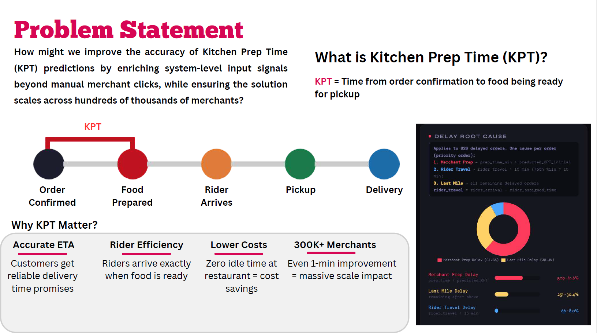
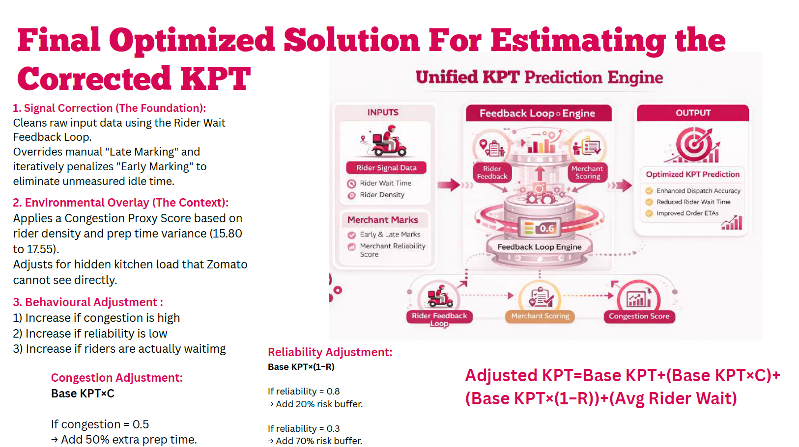
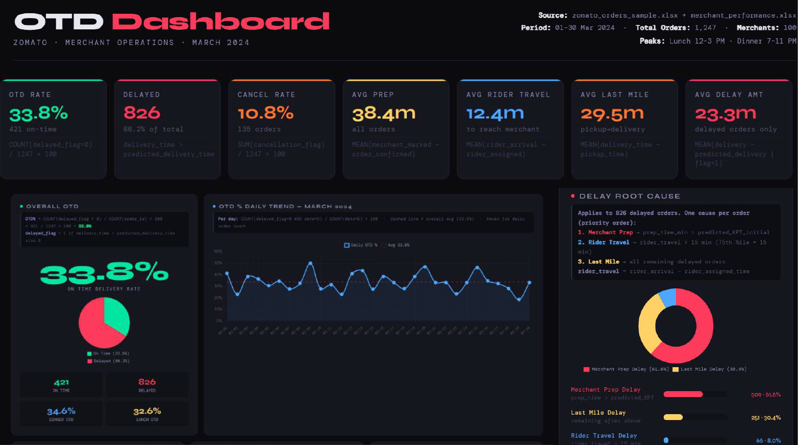

# Zomato KPT Optimization – Improving ETA Accuracy

> Designed a scalable system to improve ETA prediction accuracy by replacing single-point inputs with a multi-signal feedback architecture.

## 🚨 Problem
Zomato’s ETA predictions are inaccurate due to unreliable kitchen prep time (KPT) signals, caused by biased merchant inputs and lack of real-time system visibility.

## 🔍 Key Insights
- ~75% of orders had biased prep-time signals due to incorrect merchant marking
- High variation in prep times (~±12 mins), reducing prediction reliability
- No visibility into external kitchen load (Swiggy, dine-in, takeaway orders)

## 💡 Solution
Designed a multi-signal KPT prediction system that improves ETA accuracy by combining:
- Rider wait-time feedback loop
- Merchant reliability scoring
- Kitchen congestion estimation

## ⚙️ Approach
- Identified root causes behind ETA inaccuracies
- Built correction logic using rider wait signals
- Segmented merchants based on behavioral reliability
- Modeled hidden kitchen congestion using proxy signals

## 📈 Impact
- Reduced dependency on unreliable merchant inputs
- Improved ETA prediction robustness across edge cases
- Enabled scalable deployment across 300K+ merchants

## 🧠 Product Thinking
Instead of relying on a single input (merchant marking), I designed a system combining:
- Behavioral signals (merchant reliability)
- Real-time signals (rider wait time)
- Environmental signals (kitchen congestion)

This makes ETA prediction more robust and scalable.

## 📎 Case Study
[zomato-kpt-case-study.pdf](./zomato-kpt-case-study.pdf)

## 📊 Datasets
- [Zomato Orders Dataset](https://docs.google.com/spreadsheets/d/1qC1GQ606XoGxHjob17DloTxdiXXABtP3/edit)
- [Rider Activity Dataset](https://docs.google.com/spreadsheets/d/1Q-6CgcgKVVziZnz7iRQ9EJBV9NTeseOV/edit)
- [Merchant Performance Dataset](https://docs.google.com/spreadsheets/d/1sbhNaCrCOxxvmu9clEUtR1LVlmFeqmcT/edit)

## 💻 Model / Analysis
[View Google Colab Notebook](https://colab.research.google.com/drive/1yONZ4VGUR9IMtQ84z02U0mlnODd10Mlf)
